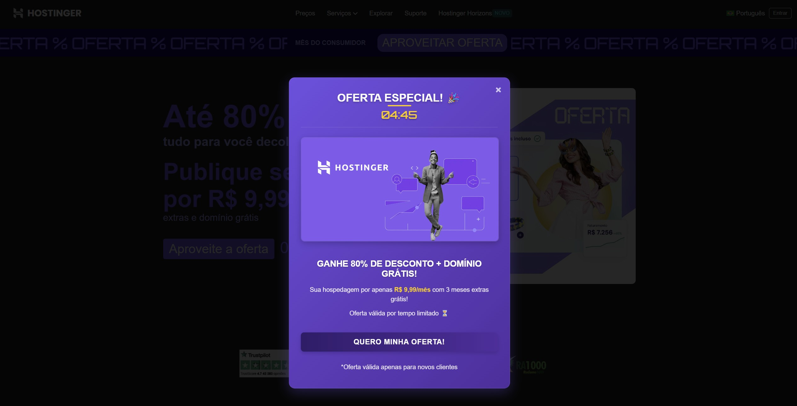

# Projeto: Remake de site/app web

Acesso: https://elc1090.github.io/project1-2025a-lorenzotaschetto/

#### Desenvolvedor(a)
Lorenzo Sacchet Taschetto - Ciência da Computação

#### Cliente
Thales Stamm

#### Site/app original

##### Link
https://www.hostinger.com.br/

##### Descrição
- Dropdowns completos: Links organizados por categorias (Hospedagem, Domínios, Email, etc.).
- Barra de promoção: Mostra ofertas temporárias (ex: "80% OFF + Domínio Grátis").
- Idioma/login: Selector de idioma e botão de login visíveis.
- Contador de promoção: Timer regressivo para criar urgência.
- Planos de Hospedagem
- Depoimentos e Avaliações: Fotos e comentários reais.
- Selo de confiança: Selos como "Melhor Custo-Benefício 2024".
- Rodapé
- Links organizados: +50 links categorizados (Hospedagem, Ajuda, Empresa).
- Métodos de pagamento: Ícones de cartões, Pix, boleto.
- Certificados de segurança: Reclame Aqui, Google Trusted Store.
- Cores: Roxo como cor primária.
- Gradientes e sombras: Efeitos modernos em botões e cards.

#### Demanda do(a) cliente
As demandas são uma navbar com uma caixinha de opções estilo dropdown, uma janela pop up de promoção, na tela principal fala mais sobre a promoção e tem uma contagem regressiva, abaixo seriam três "cartões", cada um falando de um tipo de planos de serviço e abaixo ficariam informações da marca (resumido), métodos de pagamento, uma área/botão para suporte com ilustração do atendimento e também ícones que redirecionam para redes sociais (no caso do exemplo ficariam só de enfeite). (Todas as demandas estão disponíveis no site)

#### Desenvolvimento
O desenvolvimento deste projeto foi estruturado em várias etapas para garantir que atendesse aos requisitos. O primeiro passo foi a coleta de conteúdo, que envolveu entender as informações essenciais que deveriam ser destacadas na página, como a barra de navegação, os planos de hospedagem e os detalhes institucionais sobre a empresa. A partir desse conteúdo, estabeleci a estrutura inicial da página, destacando as seções principais, como a "Seção Hero", que teve como objetivo chamar a atenção do usuário com um contador para gerar urgência, e a barra de navegação que deveria ser simples e intuitiva. Para o esquema de cores, escolhi tons escuros, que proporcionam uma boa base para o contraste, e adicionei detalhes em roxo. Foi usado Poppins para os textos, que oferece uma leitura confortável e moderna, e Orbitron para os elementos de destaque, como títulos e botões, criando um contraste visual. A barra de oferta foi configurada para exibir uma animação de scroll-text, criando dinamismo na página, enquanto efeitos de hover foram aplicados, proporcionando uma experiência mais interativa. Para os planos de hospedagem, criei cards comparativos para facilitar a visualização e comparação entre as opções disponíveis, e os métodos de pagamento, assim como a indicação de suporte, foram apresentados com ícones, garantindo que a informação fosse clara e visualmente acessível.

#### Tecnologias
- HTML
- CSS
- JAVASCRIPT

#### Ambiente de desenvolvimento
- VS CODE
- LIVE SERVER
- MICROSOFT COPILOT

#### Referências e créditos
- https://www.w3schools.com/
- ChatGPT (Como fazer a animação da barra de promoção scrollar infinitamente?; Como alinhar uma imagem com texto ao lado dela?; Como criar um efeito de "hover" para uma imagem, o qual alteraria o alinhamento ou o tamanho?)

---
Projeto entregue para a disciplina de [Desenvolvimento de Software para a Web](http://github.com/andreainfufsm/elc1090-2025a) em 2025a
